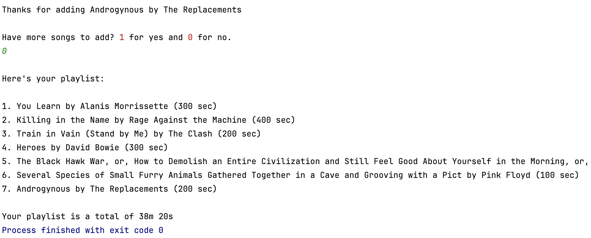

## CSCI-3 Project #2
#### By: Dustin Stewart
### NOTE: I added these files to Github [here](https://github.com/dustin-stew/CSCI3_Project2/) if that's easier. I also made a JavaFX version for fun [here](https://github.com/dustin-stew/PlaylistMaker5000).
### Structure
[Playlist.java](src/Playlist.java) - This  file serves as the entrypoint for the application. Compile and run from this file.
###### Helpful notes
* The format for song entries is to have each object (title, artist, duration) on a different line
* You can copy and paste the test entries on the bottom
* After each song, you will be prompted to continue or not. Typing 1 then enter will ask for another song and 0 will compile and print the playlist.

[Song.java](src/Song.java) - This file houses the central class of the application, allowing the professor to create an object to represent a student's quiz scores.

### Challenges
* **Regex struggles** - When confirming the entry from the user, you probably wouldn't output metadata like the duration, but filtering that out of the string proved difficult due to parentheses within song titles. I didn't want to create another string method for a duration excluded string, but that would probably be easiest.

### Test Cases

**TEST VALUES**

You Learn  
Alanis Morrissette  
300  
1  
Killing in the Name  
Rage Against the Machine  
400  
1  
Train in Vain (Stand by Me)  
The Clash  
200  
1  
Heroes  
David Bowie  
300  
1  
The Black Hawk War, or, How to Demolish an Entire Civilization and Still Feel Good About Yourself in the Morning, or, We Apologize for the Inconvenience but You're Going to Have to Leave Now, or, 'I Have Fought the Big Knives and Will Continue to Fight Them Until They Are Off Our Lands'  
Sufjan Stevens  
800  
1  
Several Species of Small Furry Animals Gathered Together in a Cave and Grooving with a Pict  
Pink Floyd  
100  
1  
Androgynous  
The Replacements  
200  

^^^Make sure to include one line of space at the end or just press enter once you paste^^^

300 + 400 + 200 + 300 + 800 + 100 + 200 = 2300 seconds
2300 second / 60 = 38.3333 minutes
38.3333 minutes = 38min 20sec
### Console Output
